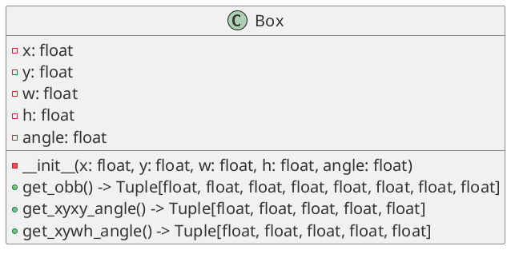
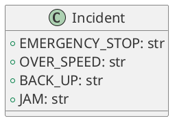
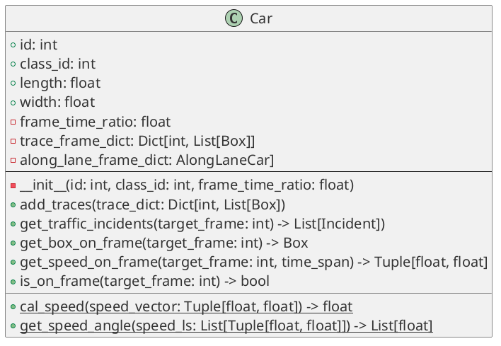
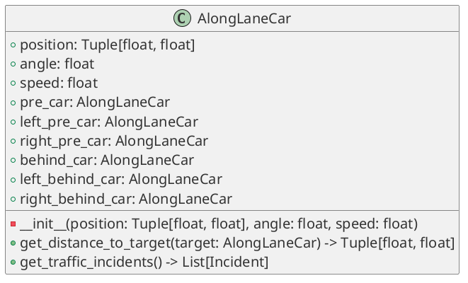
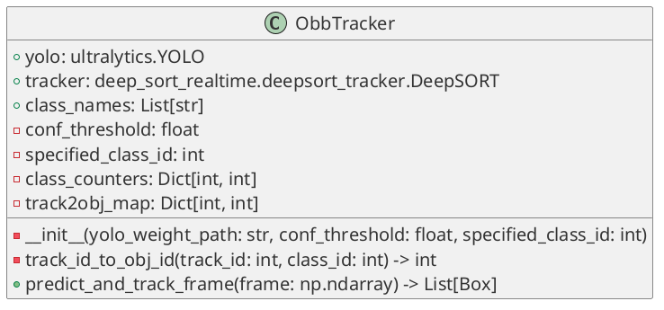
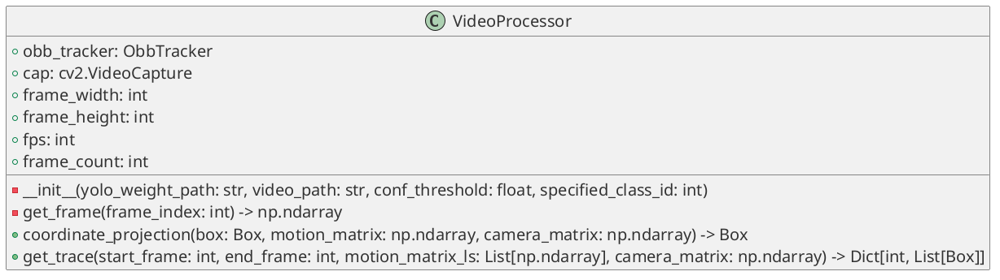
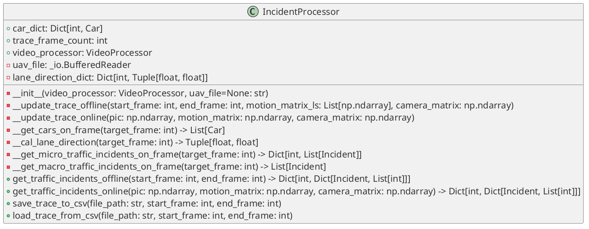

This project is based on YOLOv10_DeepSORT by sujanshresstha, licensed under MIT License.

# 使用conda创建环境
```shell
git clone https://github.com/zhangerfa/traffic_accident.git
cd traffic_accident     

conda env create -f conda.yml
conda activate yolov11

conda install pytorch==2.0.1 torchvision==0.15.2 torchaudio==2.0.2 pytorch-cuda=11.7 -c pytorch -c nvidia
conda install numpy<2
```
# 交通事件分类
以判定交通事件发生所需的信息类型角度，可以将交通事件分为以下三类：  
1.	基于车辆自身运动的交通事件  
只和车辆自身运动数据有关的交通事件如急刹车，超速等。其中车辆自身运动数据包括车辆随时间变化的位置、长宽、朝向、速度等。
2.	基于道路行驶规则的交通事件  
基于道路行驶规则的交通事件是指既需要车辆自身运动数据，又需要车辆所在道路的行驶规则才可以判定的交通事件，如逆行，倒车，违法停车等。道路行驶规则主要包含道路的行驶方向等。
3.	基于车辆间关系的交通事件  
基于车辆间关系的交通事件是指既需要车辆自身运动数据，也需要车辆之间的关系才可以判定的交通事件，车辆之间的关系包括前/后车，左前/右后车，右前/左后车关系，如跟车距离过近，变道时与变道侧前车距离不足等。

# 代码结构
## 类介绍
### Box：检测框

Box类用于存储检测框的信息，创建Box对象时传入xywh-angle格式的旋转框数据，内部提供不同旋转框格式的转换，具体包含以下接口：
1. get_obb() -> Tuple[float, float, float, float, float, float, float, float]  
    获取旋转框的obb格式数据，返回值为(x1, y1, x2, y2, x3, y3, x4, y4)。
2. get_xyxy_angle() -> Tuple[float, float, float, float, float]  
    获取旋转框的xyxy-angle格式数据，返回值为(x1, y1, x2, y2, angle)。
3. get_xywh_angle() -> Tuple[float, float, float, float, float]  
    获取旋转框的xywh-angle格式数据，返回值为(x, y, w, h, angle)。
### Incident：交通事件枚举类

Incident类是一个枚举类，包含交通事件的类型，用户根据需要添加交通事件类型。
### Car：车辆基本信息+原始轨迹数据

Car中存储车辆基本信息和车辆的历史轨迹，基本信息包括车辆的id，类别id（class_id）, 长（length）、宽（width），车辆类别id是车辆首次被检测到时识别出的类型，车辆的长宽是车辆所有被识别到的检测框的长宽的平均值。历史轨迹数据使用哈希表trace_frame_dict存储，以帧索引作为key，以轨迹（中心点的x，y坐标，车辆朝向角angle）作为value，从而存储车辆在历史上每一帧的位置和朝向。Car中存储的轨迹数据用来计算速度、将车辆轨迹等数据画在原始图片上，提取基于车辆自身运动的交通事件。

Car包含以下公有接口：
1. add_traces(trace_dict: Dict[int, List[Box])  
    添加车辆的历史轨迹数据，入参和Car中存储的trace_frame_dict格式一致，trace_dict的key为帧索引，value为轨迹数据（中心点的x，y坐标，车辆朝向角angle）。     
    除此以外，在添加轨迹数据时，会计算增量轨迹中的车辆平均长度、宽度，如果当前车辆的长度，宽度未设置，则会设置为增量轨迹中的平均长度、宽度；否则按当前增量轨迹的帧数加权平均更新车辆的长度、宽度。
2. get_traffic_incidents(target_frame: int) -> List[Incident])  
    获取车辆在target_frame帧上的交通事件。返回值为车辆在target_frame帧上基于车辆自身运动的交通事件列表。
3. get_box_on_frame(target_frame: int) -> Box  
    获取车辆在指定帧上的外框。注意：返回值中的车辆长宽并不是target_frame帧识别到的车辆的长宽，而是车辆所有被识别到的检测框的长宽的平均值。
4. get_speed_on_frame(target_frame: int, time_span) -> Tuple[float, float]  
    获取车辆在target_frame上的速度向量。入参time_span是指计算速度的时间跨度，单位为秒，如time_span=0.5表示计算车辆在target_frame帧上的速度向量时，使用target_frame帧时刻及target_frame帧前0.5秒的位移差/0.5秒作为车辆在target_frame时刻的速度。其中，target_frame前0.5秒的位置需要先将秒换算为帧，需要用到frame_time_ratio字段，frame_time_ratio存储了一帧等于的时间跨度，因此传入的时间跨度/frame_time_ratio的值向下取整后即为计算速度的起始帧。
5. is_on_frame(target_frame: int) -> bool  
    判断车辆是否出现在target_frame帧上，如果车辆轨迹中包含target_frame帧，则返回True，否则返回False。
6. cal_speed(speed_vector: Tuple[float, float]) -> float  
    本方法为类方法，不依赖Car实例数据，用于计算速度向量的模，也就是速度的大小。入参speed_vector为速度向量。
7. get_speed_angle(speed_ls: List[Tuple[float, float]]) -> List[float]  
    本方法为类方法，不依赖Car实例数据，用于计算速度向量的角度。入参speed_ls为速度向量列表，返回值为速度向量的角度列表。

### AlongLaneCar：道路行驶方向坐标系下的车辆信息，包含车辆周围关系，用于计算基于车辆周围关系的交通事件

AlongLaneCar存储车辆在道路行驶方向坐标系下的信息：车辆中心点坐标（position）、朝向角（angle）、速度（speed），还包括车辆周围关系：车辆的前车（pre_car）、左前车（left_pre_car）、右前车（right_pre_car）、后车（behind_car）、左后车（left_behind_car）、右后车（right_behind_car）。  
AlongLaneCar的作用是提取基于车辆周围关系的交通事件，AlongLaneCar包含以下公有接口：
1. get_distance_to_target(target: AlongLaneCar) -> Tuple[float, float]  
    获取车辆到目标车辆的距离和相对速度。入参为目标车辆，返回值为车辆到目标车辆的距离和相对速度。调用此接口可以方便计算车辆与其周围车辆之间的距离。
2. get_traffic_incidents() -> List[Incident]  
    获取基于车辆周围车辆之间的交通事件列表，返回值为Incident实例对象列表。
### ObbTracker：封装识别和追踪功能

ObbTracker封装了YOLO和DeepSORT，提供了识别和追踪功能。ObbTracker封装了图片识别和连续图片追踪的功能，内部包含YOLO实例对象yolo，DeepSORT实例对象tracker，类别名称列表class_names，置信度阈值conf_threshold，用于识别；除此以外还有指定识别的类别id：specified_class_id，当specified_class_id有值时只会识别specified_class_id指定的类别，也就是过滤其他被识别到的类型的对象，当specified_class_id未赋值时识别所有类别的对象；类别计数器class_counters，跟踪器id到车辆id的映射track2obj_map则用来为每个被识别到的对象计算其独立的id。
ObbTracker包含以下公有接口：
1. track_id_to_obj_id(track_id: int, class_id: int) -> int  
    此接口为对象生成唯一表示id——obj_id，并且在id中包含分类信息，obj_id是表示当前对象是所属类的第几个对象，也就是说对象由 类别-obj_id 唯一标识，track_id则是追踪id，也可以唯一标识对象，但不区分类。  
    该方法的具体实现为：  
   1. 判断class_id是否在class_counters中，如果不在则将class_id添加到class_counters中，value为0；
   2. 为每个被识别到的对象计算其独立的id，id的计算规则为：class_id * 1000 + class_counters[class_id]，class_counters[class_id]自增1；
   3. 返回对象id。
2. predict_and_track_frame(frame: np.ndarray) -> List[Box]  
    对输入的图片帧进行识别和追踪，返回值为Box实例对象列表，每个Box实例对象表示一个被识别到的对象的检测框。需要注意的是，对predict_and_track_frame方法的调用是有状态的，也就是说，调用predict_and_track_frame方法时，会根据上一帧的追踪结果，对当前帧的对象进行追踪，如果当前帧的对象与上一帧的对象有重叠，则认为是同一个对象，否则认为是新的对象。因此对predict_and_track_frame方法的调用需要保证帧的连续性，不能跳帧调用。  
    此接口的内部实现为：
   1. 调用self.yolo的detect方法对输入的图片帧进行识别，获取识别结果；
   2. 由检测输出构建追踪输入：由于输入deepsort的检测框在obb的情况下不是原检测框，因此建立输入deepsort的检测框和原检测框映射，key为输入deepsort的检测框序号，value是原检测框；
   3. 调用self.tracker的update方法对输入的检测框进行追踪，获取追踪结果；
   4. 由追踪框获取原检测框，并依次调用self.track_id_to_obj_id为每个成功追踪的对象获取obj_id——唯一表示对象的id、类别id一起封装返回。
### VideoProcessor：暴露给用户的视频处理接口

VideoProcessor提供了视频处理的接口，内部封装了ObbTracker实例对象obb_tracker用于图片的车辆识别以及连续图片的车辆追踪，创建VideoProcessor对象时构建函数需要传入YOLO模型的权重文件路径yolo_path，识别的置信度conf_threshold和只识别特定类别specified_class_id（具体参考ObbTracker中的specified_class_id字段含义）。此外还有cv2.VideoCapture实例对象cap用于读取视频等视频数据处理功能。还存储了视频基本信息：视频帧宽frame_width，视频帧高frame_height，视频帧率fps，视频总帧数frame_count。  
VideoProcessor提供以下公有接口：
1. get_frame(frame_index: int) -> np.ndarray  
    获取视频中指定帧的图片帧，返回值为numpy数组，表示视频中指定帧的图片帧。
2. coordinate_projection(box: Box, motion_matrix: np.ndarray, camera_matrix: np.ndarray) -> Box  
    入参为检测框box、无人机运动矩阵motion_matrix、相机内参矩阵camera_matrix。方法的作用是将检测框box的坐标投影到无人机运动矩阵motion_matrix和相机内参矩阵camera_matrix所描述的坐标系中。返回值为Box实例对象，表示投影后的检测框。
3. get_trace(start_frame: int, end_frame: int, motion_matrix_ls: List[np.ndarray], camera_matrix: np.ndarray) -> Dict[int, List[Box]]  
    入参为提取退机的帧索引范围和该范围内的无人机运动矩阵、相机内参矩阵。方法的作用是从视频中提取[start_frame, end_frame]帧索引范围内的轨迹数据，并对检测结果调用self.coordinate_projection(box, motion_matrix, camera_matrix)进行坐标投影。返回值为哈希表，以帧索引为key，车辆检测框列表为value。需要注意的是：为了保证轨迹的连续，连续调用该接口时入参的帧索引范围也应该连续，如果两次调用该接口所获取的轨迹的帧范围不连续，那么轨迹也会出现不连续，可能造成同一辆车的轨迹被识别为两辆车的轨迹的情况。
### IncidentProcessor：车道空间+提取交通事件

IncidentProcessor提供了所有最终暴露给用户的接口，其内部封装了视频处理和对视频中提取的交通信息处理为交通事件的过程。创建时需要提供提取交通事件的视频处理器videoProcessor实例对象，存储无人机运动数据和相机内参矩阵的文件uav_file，如果是在线获取事件形式则不传入uav_file入参。IncidentProcessor包括车道空间的道路行驶方向（lane_direction_dict，哈希表，以帧索引为key，方向向量为value，惰性计算，计算后缓存），车辆集合（car_dict，哈希表，以车辆id为key，Car实例对象为value），视频处理器video_processor，还有一个私有字段trace_frame_count，用于记录当前轨迹已经提取的帧数范围。  
IncidentProcessor提供以下私有接口，由于设计对整体模块的理解，介绍如下：
1. __update_trace_offline(start_frame: int, end_frame: int, motion_matrix_ls: List[np.ndarray], camera_matrix: np.ndarray)   
    更新[start_frame, end_frame]帧索引范围内的车辆轨迹数据。方法内部会调用self.video_processor.get_trace(start_frame, end_frame, motion_matrix_ls, camera_matrix)方法获取车辆检测框列表来提取车辆轨迹并将轨迹数据保存到当前self.car_dict中；
2. __update_trace_online(pic: np.ndarray, motion_matrix: np.ndarray, camera_matrix: np.ndarray)  
    更新传入图片帧的车辆轨迹数据。方法内部会调用self.video_processor.obb_tracker.predict_and_track_frame(pic)方法获取车辆检测框列表，并调用self.videoProcessor.coordinate_projection(box, motion_matrix, camera_matrix)将坐标投影到指定帧，从而提取车辆轨迹并将轨迹数据保存到当前self.car_dict中；
3. __get_cars_on_frame(target_frame: int) -> List[Car]  
    获取target_frame帧上的车辆集合，返回值为Car实例对象列表。
4. __cal_lane_direction(target_frame: int) -> Tuple[float, float]  
    计算target_frame帧上的道路行驶方向，返回值为道路行驶方向向量。该方法的具体实现为：
   1. 判断self.lane_direction_dict中是否存在target_frame帧的道路行驶方向，如果存在则直接返回道路行驶方向向量；如果不存在继续执行下面的步骤；
   2. 调用self.__get_cars_on_frame(target_frame)方法获取target_frame帧上的车辆集合；
   3. 获取所有车辆的速度向量，对车辆速度归一化处理，使得速度大小不影响聚类结果，从而满足针对速度方向进行聚类；
   4. 聚类后对每组的速度集合中使用统计方法剔除明显偏离车道方向的速度矢量，具体是指对速度矢量归一化后求平均来描述平均速度方向，计算每个速度矢量与平均速度方向的夹角，计算夹角的标准差，剔除夹角大于2倍标准差的速度矢量；
   5. 每组车辆速度矢量的矢量和的方向作为车道方向，将车道方向向量存储到self.lane_direction_dict中，返回车道方向向量。
5. __get_micro_traffic_incidents_on_frame(target_frame: int) -> Dict[int, List[Incident]]  
    获取车道空间在target_frame帧上的所有微观交通事件，返回值为哈希表，以车辆id为key，交通事件列表为value。该方法的具体实现为：
   1. 调用self.__get_cars_on_frame(target_frame: int)方法获取target_frame帧上的车辆集合；
   2. 遍历当前帧所有车道空间中的车辆集合，调用Car.get_traffic_incidents(target_frame)方法获取车辆在target_frame帧上的交通事件列表；
   3. 遍历当前帧所有车道空间中的车辆集合，提取target_frame帧的道路行驶方向，将车辆集合投影到道路target_frame帧道路行驶坐标系，将投影后的车辆集合按道路行驶方向距离由近到远排序，遍历排序后车辆提取每辆车的周围车辆关系得到AlongLaneCar列表，遍历AlongLaneCar列表，调用AlongLaneCar.get_traffic_incidents()方法获取基于车辆周围车辆之间的交通事件列表；
   4. 获取基于道路行驶规则的交通事件列表；
   5. 合并以上三个交通事件列表，也就是车道空间在target_frame帧上的所有交通事件，其中返回值是一个哈希表，key为车辆id，value为Incident列表，一个元素表示一个车辆所触发的所有交通事件。
6. __get_macro_traffic_incidents_on_frame(target_frame: int) -> List[Incident]  
    获取车道空间在target_frame帧上的所有宏观交通事件，返回值为交通事件列表。

IncidentProcessor提供以下公有接口：
1. get_traffic_incidents_offline(start_frame: int, end_frame: int) -> Dict[int, Dict[Incident, List[int]]]  
    获取[start_frame, end_frame]帧索引范围内视频中的所有交通事件，如果start_frame为None则提取整个视频的交通事件。返回值为哈希表，哈希表包含两个key：micro_incidents和macro_incidents，分别对应微观交通事件和宏观交通事件。micro_incidents对应的value也是一个哈希表存储车辆所触发的所有微观交通事件，并记录交通事件触发的帧索引范围，具体来说以car_id为key，{Incident实例对象: 该交通事件发生的帧索引列表}的哈希表为value。macro_incidents对应的value也是一个哈希表存储所有宏观交通事件，其中key为Incident实例对象，value为该交通事件发生的帧列表。  
    该方法的具体实现为:
   1. 从self.uav_file中读取[start_frame, end_frame]帧索引范围内无人机运行矩阵构成motion_matrix_ls，读取相机内参矩阵camera_matrix是；
   2. 调用self.__update_trace(start_frame, end_frame)方法更新[start_frame, end_frame]帧索引范围内的车辆轨迹数据；
   3. 从start_frame每隔三分之一秒（换算后就是每隔self.fps/3帧）识别一次交通事件并将交通事件整合到已识别的交通事件返回值中，直到end_frame，识别过程为：
      1. 调用self.__get_micro_traffic_incidents_on_frame(target_frame)方法获取当前帧的微观交通事件，将当前帧车辆触发的交通事件汇总到该车辆触发的所有交通事件中；
      2. 调用self.__get_macro_traffic_incidents_on_frame(target_frame)方法获取当前帧的宏观交通事件，将当前帧触发的宏观交通事件汇总到所有宏观交通事件中；
2. get_traffic_incidents_online(pic: np.ndarray, motion_matrix: np.ndarray, camera_matrix: np.ndarray)  
    通过网络连续传入图片，将图片数据添加到消息队列中，会维护一个线程消费消息队列中的消息，其内部会调用self.__update_trace_online(pic, motion_matrix, camera_matrix)来更新轨迹数据后，识别交通事件，过程和get_traffic_incidents_offline基本一致，这里不再赘述。需要注意的是：调用该接口时连续传入的图片应该是视频中的连续帧，否则会导致车辆轨迹不连续，从而识别不到交通事件。
3. to_csv(file_path: str)  
    将车道空间的交通事件数据保存到csv文件中，file_path为文件路径。
4. load_trace_from_csv(file_path: str)  
    提取csv文件中的车辆轨迹数据，file_path为文件路径。